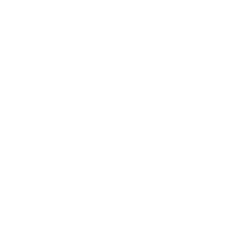

<br />
<div align="center">

<h3 align="center">Go Chat – Realtime Chat App</h3>

  <p align="center">
    A minimal, modern 1‑to‑1 chat application built with MERN & Socket.IO, featuring light/dark theme, image messaging, and online status.
    <br />
    <br />
    <a href="https://go-chat-rosy.vercel.app/">Go Chat</a> click to see the demo
    
  </p>
</div>

---
## About The Project


**Go Chat is a full‑stack real‑time chat application.  
It supports 1‑to‑1 messaging, image sending, read receipts, online status, and a clean light/dark UI that works well on desktop and smaller screens.**

**Key features**

- User authentication (sign up / login) with JWT
- Profile page: change name, avatar, and bio
- Realtime 1‑to‑1 chat via Socket.IO
- Text and image messages (stored on Cloudinary)
- Message timestamps and seen status
- Online/offline status
- Unread message badges per contact
- Three‑panel layout:
  - Sidebar with search & contact list
  - Chat container with bubble UI
  - Right sidebar with user info & image history
- Global light/dark theme toggle (stored in localStorage)

This project is built as a learning / portfolio app, not for production or commercial use.

### Built With

- **Frontend**
  - [React](https://react.dev/)
  - [React Router](https://reactrouter.com/)
  - Context API (`AuthContext`, `ChatContext`, `ThemeContext`)
  - [Socket.IO Client](https://socket.io/)
  - [Tailwind CSS](https://tailwindcss.com/) (via utility classes in `index.css`)

- **Backend**
  - [Node.js](https://nodejs.org/) + [Express](https://expressjs.com/)
  - [MongoDB](https://www.mongodb.com/) + [Mongoose](https://mongoosejs.com/)
  - [Socket.IO](https://socket.io/) server
  - [Cloudinary](https://cloudinary.com/) (image storage)
  - JWT authentication
  - Deployed on [Render](https://render.com/) (Web Service)

---

## Getting Started

To run the project locally, you’ll need to start both the server and the client.

### Prerequisites

- Node.js (>= 18 recommended)
- npm
- A MongoDB connection string (Atlas or local)
- A Cloudinary account (for image upload)

### Installation

1. **Clone the repo**

```bash
git clone https://github.com/K-L-16/GoChat.git
cd GoChat
```

2. **Set up the backend and frontend**

### Typical flow 

- Sign up with name, email, password and short bio.
- Log in; online users appear in the left sidebar.
- Use the search bar to find users.
- Click a user in the sidebar to open a chat:
- Send text messages.
- Click the image icon to send photos (<= 4MB, handled by Cloudinary).
- The right sidebar shows the current contact’s avatar, name, bio, and an image history grid.
- Use the theme toggle (in the sidebar header) to switch between light and dark mode.
- Update your profile from the sidebar menu (“Edit Profile”).

### License
MIT
